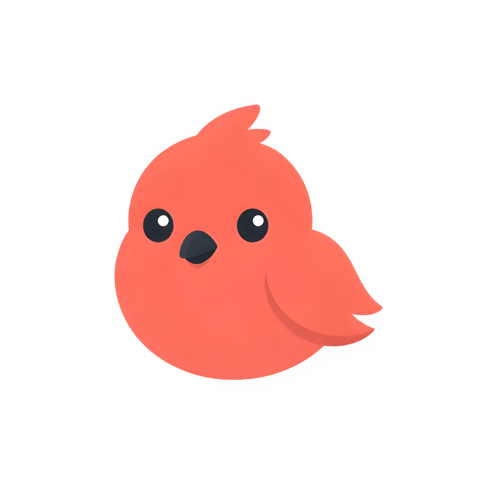
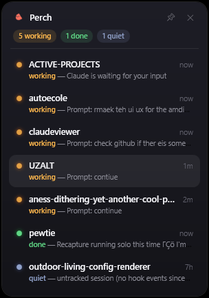

<p align="center">
  
</p>

<h1 align="center">perch</h1>

<p align="center"><b>claude sessions manager — for windows</b></p>

<p align="center">
  a smol always-on-top bird that watches your claude code sessions<br>
  so you don't have to alt-tab through 10 terminal tabs like a maniac
</p>

<p align="center">
  
</p>

---

## why

i run a LOT of claude code sessions at once. multiple windows terminal windows, tabs everywhere. at some point i genuinely could not tell which session was done, which one was stuck waiting for me to click "allow", and which one was still cooking.

so i made perch. it's a tiny card that sits in the corner of your screen and just... tells you:

- 🔴 **needs you** — waiting for permission or input (pulses + resurfaces so you actually notice)
- 🟠 **working** — still cooking
- 🟢 **done** — finished, waiting for your next prompt
- 🔵 **quiet** — a live agent perch found on its own, no events from it yet

and the best part: **click a row and it jumps to the EXACT windows terminal tab.** not "roughly the right window" — the exact tab, deterministically. (this took an embarrassing amount of effort, see war stories below.)

## stuff it does

- live status for every claude code session, via hooks
- click-to-focus down to the exact tab
- right-click a row → **pin to top**, **rename**, **hide** (remembered per project folder)
- pin the widget = always on top. unpin = it stays out of your way and just flashes the taskbar when something needs you
- also spots `codex` / `gemini` / `opencode` / `aider` sessions out of the box (add whatever names you want to the list)
- dead sessions disappear on their own, headless subagents / agent-team workers are hidden
- one powershell script. no electron. no node_modules. your grandma's windows can run it

## "isn't there already something like this?"

kind of, but not really — i looked:

- [claude-squad](https://github.com/smtg-ai/claude-squad) (8k★) and [ccmanager](https://github.com/kbwo/ccmanager) (1k★) are great, but they're terminal multiplexers: you run your sessions *inside* them, tmux-style. that's a whole workflow change.
- there's a small army of cute menubar companions (Pulse, notch dynamic-island apps, claude-code-menubar ×3...) — **every single one is macOS**.
- windows had... a notification popup script. that's it.

perch is different on both axes: it's **windows-native**, and it watches the
windows terminal tabs **you already have** — no tmux, no TUI to live inside,
no workflow change. your sessions don't even know it exists.

## install

you need: windows 10/11, windows terminal, and [claude code](https://claude.com/claude-code) (for the live statuses — other CLIs get presence + click-to-focus without any setup).

```powershell
git clone https://github.com/anessbelbati/perch-claude-sessions-manager perch
cd perch
powershell -NoProfile -ExecutionPolicy Bypass -File install.ps1 -DesktopShortcut
```

the installer copies the hook to `%LOCALAPPDATA%\AgentFocus\`, compiles a tiny helper dll, and gently merges the hook into your `~/.claude/settings.json` (it backs it up first and never touches your existing hooks). add `-StartupShortcut` if you want perch at login.

then double-click **`Perch.vbs`**. that's it. sessions you start after installing get full statuses; ones already running show up as soon as they do anything.

## other CLI tools

any agent CLI running in a windows terminal tab shows up automatically if its process name is in `AgentProcessNames` (`%LOCALAPPDATA%\AgentFocus\settings.json`). that gives you presence + click-to-focus with zero setup.

for real statuses the tool needs to tell perch what it's doing — pipe one JSON line to `agent-focus-status.ps1 -Provider <name>`:

```json
{"hook_event_name":"Stop","session_id":"<stable-id>","cwd":"<dir>","last_assistant_message":"..."}
```

| event | shows as |
|---|---|
| `UserPromptSubmit` / `PreToolUse` / `PostToolUse` | working |
| `Stop` | done |
| `Notification` | needs you |
| `StopFailure` | failed |
| `SessionEnd` | gone |

**codex** users: there's a ready-made adapter. in `~/.codex/config.toml`:

```toml
notify = ["powershell.exe", "-NoProfile", "-ExecutionPolicy", "Bypass",
          "-File", "<wherever-you-cloned-perch>\\codex-notify-adapter.ps1"]
```

## how it works (nerd corner)

the hard problem is mapping a session to its exact tab. tab titles change constantly (spinner glyphs, task summaries) and guessing from the foreground window is a disaster if you tab-hop fast.

the trick: claude code hooks run as child processes of the claude process, so the hook can `AttachConsole()` into claude itself — and that console's title IS the session's tab title (ConPTY mirrors it up to windows terminal). match that against all tabs via UI Automation, and if the title isn't unique, briefly stamp a unique marker title on the console, find which tab shows it, restore the title. boom: session ↔ tab, no guessing.

clicking a row re-matches against live tabs (fresh title first, UIA runtime id as tiebreaker), restores the window if minimized, selects the tab, brings it forward.

## war stories

things that bit me so they don't have to bite you:

- **never capture from the foreground window.** with fast tab-hopping the hook fires late and records whatever's focused. it once stored *spotify* as a session's location. clicking that row opened spotify.
- **never touch a suspended process's console.** agent-team workers get suspended; their console server can't answer and `GetConsoleTitle` blocks forever. perch froze windowless at startup because of this.
- **`DragMove()` eats child clicks.** the draggable header was swallowing every click on the pin button. mark the buttons' mouse-down as handled or they're decorative.
- **powershell + WPF share one thread.** nested message pumps (menus!) stop each other's pipelines; a `trap { break }` then killed the whole app, and later an orphaned "refresh in progress" flag froze it silently. guard flags must be time-limited leases, not locks.
- **`AttachConsole` resets std handles.** bind `[Console]::Out` before the first attach or your stdout just... stops.
- **taskbar icons lie.** a powershell-hosted WPF window shows the powershell icon until you set your own `AppUserModelID`.
- **process-hunting by command-line substring matches your own diagnostic process.** i killed my own kill-script mid-run more than once.

## files

| file | what |
|---|---|
| `perch.ps1` | the widget (single WPF file) |
| `hooks/agent-focus-status.ps1` | claude code hook: events → status JSONs |
| `install.ps1` | installer |
| `Perch.vbs` | consoleless launcher |
| `codex-notify-adapter.ps1` | codex notify → status adapter |
| `gen-icon.ps1` | rebuilds the icon from `logo.png` |

debugging: `perch.ps1 -Probe` prints the session table. `hud-error.log` has survived errors, `hud-boot.log` has startup stages.

## license

MIT. it's a personal tool i made for me — if it's useful to you, cool 🐦

built with [claude code](https://claude.com/claude-code), naturally.
