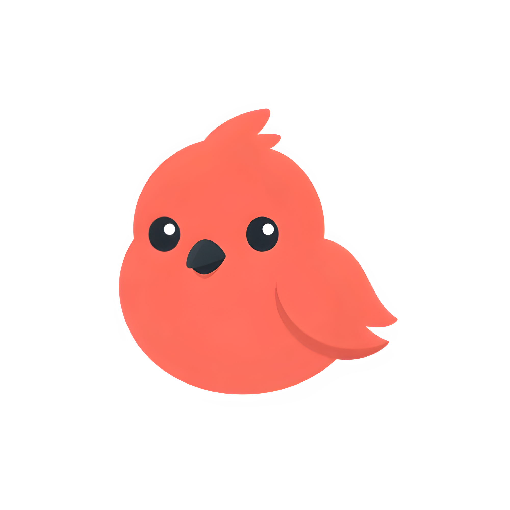
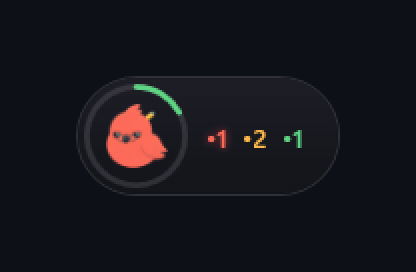
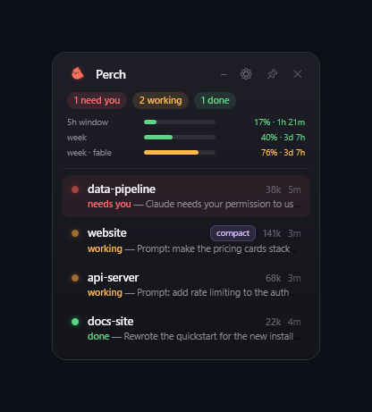

<p align="center">
  
</p>

<h1 align="center">perch</h1>

<p align="center"><b>claude sessions manager — for windows</b></p>

<p align="center">
  a smol always-on-top bird that watches your claude code sessions<br>
  so you don't have to alt-tab through 10 terminal tabs like a maniac
</p>

<p align="center">
  
</p>
<p align="center"><sub>a session finishes → double chirp, party hat, confetti. that's the whole pitch.</sub></p>

<p align="center">
  
</p>

---

## why

i run a LOT of claude code sessions at once. multiple windows terminal windows, tabs everywhere. at some point i genuinely could not tell which session was done, which one was stuck waiting for me to click "allow", and which one was still cooking.

so i made perch. it's a tiny card that sits in the corner of your screen and just... tells you:

- 🔴 **needs you** — waiting for permission or input (pulses + resurfaces + a single chirp so you actually notice)
- 🟠 **working** — still cooking (background tasks included — perch sees those even though hooks can't)
- 🟢 **done** — finished **and readable**: perch waits for the terminal to stop typing before it says so, then double-chirps
- 🔵 **quiet** — a live agent perch found on its own, no events from it yet

and the best part: **click a row and it jumps to the EXACT windows terminal tab.** not "roughly the right window" — the exact tab, deterministically. (this took an embarrassing amount of effort, see war stories below.)

## stuff it does

- live status for every claude code session, via hooks
- click-to-focus down to the exact tab
- **the tab strip itself tells you**: every session's windows terminal tab wears a native ring badge painted by the hook — **spinning arc = working** (a little arc actually *orbiting* the icon slot, motion means cooking), **full ring = finished**, **half arc = needs you**. the taskbar icon plays along too — green/red verdicts, indeterminate pulse while working — so the whole fleet is readable with the terminal minimized and perch closed. esc-interrupting a turn fires no hook at all, so perch itself watches for spinners that outlive their session's verified state and wipes them (only ever the spinner — verdict rings are hook-earned). (yes, we once declared this impossible — see war stories for the recantation.) kill switch: an empty `badge.off` file in `%LOCALAPPDATA%\AgentFocus`
- right-click a row → **pin to top**, **rename**, **hide** (remembered per project folder)
- **rename the TAB and the row follows**: rows adopt your windows terminal tab names — rename a tab and the row wears it within seconds (the tab strip is the namespace you actually curate, so it outranks older perch-side renames). arbitrarily-renamed tabs are anonymous to every title matcher, so an **ambient learner** fingerprints whichever tab you're looking at against the anonymous sessions' known screens — perch learns your tabs just from you working in them, no clicks, no tab flipping. adopted names are **written into the per-folder prefs**, so they survive reboots instead of resetting to whatever the rows were called before the rename
- pin the widget = always on top. unpin = it stays out of your way and just flashes the taskbar when something needs you
- also spots `codex` / `gemini` / `opencode` / `aider` sessions out of the box (add whatever names you want to the list)
- dead sessions disappear on their own, headless subagents / agent-team workers are hidden
- **done means DONE — three independent truth lanes**: hooks report events, but hooks alone lie in both directions (they fire when the *model* finishes while the terminal is still typing the answer, and they're structurally blind to background tasks that keep cooking after `Stop`). so perch cross-examines: **(1)** the hook trail, **(2)** claude code's own live self-report in `~/.claude/sessions/<pid>.json` — busy/idle/asking, background tasks included, flips instantly on esc, and **(3)** the console's actual pixels — a "done" row holds at working until one probe shows the screen calm and the answer is *readable*. the finish chirp additionally demands that the hooks *authored* the idle, so a manual `/compact` or an esc-interrupt never fakes a celebration
- **statuses that can't get stuck**: for sessions without the native self-report (codex, gemini, anything hookless) perch notices a suspiciously stale busy row, quietly reads the console's actual screen, and corrects the label — a permission prompt hiding under "working" gets promoted to **needs you**, and a session stuck in `Unable to connect to API … retrying` shows as **api retry** (and flips back to working on its own the moment a retry gets through)
- **one-click `/compact`**: past a context threshold you set (default 120k tokens, `0` = off) a purple **compact** chip appears on the row. click it and perch attaches to that session's console **by PID** and types `/compact` + Enter straight into its input buffer — no focus steal, no tab switch, works even minimized, wrong-window impossible. **never automatic** — you click, or nothing happens
- **prompt peek**: hover any row → a little tooltip with the last thing you asked and the last thing claude answered, without touching the tab. read lazily from the transcript tail, cached, costs nothing until you linger
- **parked**: a needs-you you've ignored for 30+ minutes (configurable) clearly wasn't that urgent — it demotes itself below "done", goes muted, stops pulsing. a fresh notification instantly brings the red back. fresh reds keep meaning *fresh*
- **crash insurance**: perch keeps a rolling snapshot of every live session (id + folder), and sessions that die stay listed for 10 more minutes — because a windows shutdown kills your terminals *before* it kills perch, and without that grace the snapshot shrinks to a splinter of the fleet right as it matters most. power cut, BSOD, accidental shutdown? on the next boot a quiet banner offers "*↻ 7 lost sessions — resume all*" — one click relaunches each one via `claude --resume`, staggered so they don't stampede, and the roll call waits for the first terminal window to actually exist so the whole fleet lands as tabs in **one** window instead of scattering. **nothing is ever relaunched automatically** — you click, or you dismiss and it's forgotten
- **compact mode**: double-click the header (or hit the `–` button) and perch folds into a tiny dynamic-island pill — the bird wearing your **5h limit as a colored ring**, next to colored need-you / working / done counts (`zzz` when everything sleeps). **click-driven, hover opens nothing**: one click = the full card (the tooltip carries a passive counts + 5h% glance) — though passing the cursor over the bird himself makes him **wave hello** (wink + tiny bounce), and if he's asleep he **cracks one eye open**, clocks you, and drifts back off. push your luck — boop him four times in a row, or **shake him mid-drag** — and he straight-up **swears at you** (`@#$%&!` grawlix bubble, steam puff, shaking fist). **drag it and you carry only the bird** — capsule, ring and counts vanish and you're holding a scruff-grabbed birb with real dangle physics until you drop him and the pill reassembles
- **red = jump, everywhere**: the pill's red count and the red "need you" chip are buttons — click one and you land straight in the terminal of the session that's been **waiting longest**, no expanding, no alt-tab roulette. same tab-matching engine as row clicks. everything still chirps, pulses and flashes — the pill just does it in ~150 pixels
- **the bird is alive**: he's the center of the pill — a big bird whose limit-ring forms the capsule's left cap, everything else orbiting him. he has a full wardrobe of state faces (generated art in `assets/bird/`): he **hatches from an egg on boot**, blinks every few seconds, goes wide-eyed with alarm when a session newly needs you, wears reading glasses while sessions work, party-hats when work finishes, side-eyes over coffee when you ignore a needs-you, fans himself as your 5h limit cooks, gets **scruff-grabbed like a kitten while you drag him**, puts on aviator goggles when you jump to a terminal, and when everything's quiet: nightcap, blanket, drool bubble, **breathing** — drifting off *through a half-lidded drowsy frame*, both ways, like a real creature. the sprite tier makes states move: he **actually flaps** through the victory hop (two-frame wing alternation with confetti physics), **sips his coffee** every few seconds while side-eyeing your ignored sessions, and **fans himself frantically in real time** while your 5h limit cooks. motions ride on top — perk wiggle, happy double-hop, supervising head-tilts and pecks, grounding squash on park — and when he's awake with nothing to do, **idle antics**: he looks around, ruffles his feathers, or hops a half-turn and briefly sulks with his back to you. every motion is an event-driven render-only moment; the loops (sleep-breathing, the fan) only run when their state is actually on screen
- **themes**: twelve rooms for your mascot to live in — the original **midnight**, **oled**, **liquid glass**, **phosphor**, **nord**, **catppuccin**, and **synthwave**, plus **cyber** (cyan circuitry), **lagoon** (deep-water aqua), **ember** (banked copper coals), **haunted** (moonlit violet), and **matcha** (moss with a honey glint). the mascot's halo re-tints to match whichever room you pick. status colors never change — those are semantics, not decoration. flip themes in ⚙ settings with live preview
- **live limit bars**: how much of your 5-hour window and weekly caps you've burned and exactly when they reset, straight from the same endpoint the CLI's `/usage` screen uses. green → amber → red as you cook, with burn-rate prediction (`caps ~15:40`) when you're on pace to hit the wall before the reset. fetched by a background child every **5 minutes** (10 when the network's down) — deliberately gentle on the API, and the UI never waits on the network. and when *everything* is unreachable (offline, api down, rate-limited), a **local estimate** takes over: perch buckets your own transcripts into the same 5-hour billing windows (ccusage-style, anchored to the server's actual reset time) and calibrates tokens-per-window against official percentages it saw earlier — so the `5h ~local` bar keeps working with zero network at all
- **account switcher**: got more than one paid Claude subscription? save each one once (`claude setup-token` → paste into ⚙ settings → claude accounts) and switching becomes one click instead of the whole logout-browser-login ritual. tokens are DPAPI-encrypted, switches apply to new sessions (`claude --continue` in a stuck tab brings your conversation back on the new account). manual only — perch never auto-switches, and honesty corner: we're not sure where Anthropic's ToS stands on rotating accounts around usage limits, so that call is yours
- **actual bird chirps**: three lovely [mixkit](https://mixkit.co/free-sound-effects/bird/) chirps ship in `sounds/` — a **single chirp** means a session needs you, a **double chirp** means work finished and the answer is ready to read. separate toggles + volume in ⚙ settings. drop your own `.wav`s in the folder to override; no wavs at all = a humble synth beep
- one powershell script. no electron. no node_modules. your grandma's windows can run it

## "isn't there already something like this?"

kind of, but not really — i looked:

- [claude-squad](https://github.com/smtg-ai/claude-squad) (8k★) and [ccmanager](https://github.com/kbwo/ccmanager) (1k★) are great, but they're terminal multiplexers: you run your sessions *inside* them, tmux-style. that's a whole workflow change.
- there's a small army of cute menubar companions (Pulse, notch dynamic-island apps, claude-code-menubar ×3...) — **every single one is macOS**.
- windows had... a notification popup script. that's it.

perch is different on both axes: it's **windows-native**, and it watches the
windows terminal tabs **you already have** — no tmux, no TUI to live inside,
no workflow change. your sessions don't even know it exists.

## install

you need: windows 10/11, windows terminal, and [claude code](https://claude.com/claude-code) (for the live statuses — other CLIs get presence + click-to-focus without any setup).

```powershell
git clone https://github.com/anessbelbati/perch-claude-sessions-manager perch
cd perch
powershell -NoProfile -ExecutionPolicy Bypass -File install.ps1 -DesktopShortcut
```

the installer copies the hook to `%LOCALAPPDATA%\AgentFocus\`, compiles a tiny helper dll, and gently merges the hook into your `~/.claude/settings.json` (it backs it up first and never touches your existing hooks). add `-StartupShortcut` if you want perch at login.

then double-click **`Perch.vbs`**. that's it. sessions you start after installing get full statuses; ones already running show up as soon as they do anything.

## other CLI tools

any agent CLI running in a windows terminal tab shows up automatically if its process name is in `AgentProcessNames` (`%LOCALAPPDATA%\AgentFocus\settings.json`). that gives you presence + click-to-focus with zero setup.

for real statuses the tool needs to tell perch what it's doing — pipe one JSON line to `agent-focus-status.ps1 -Provider <name>`:

```json
{"hook_event_name":"Stop","session_id":"<stable-id>","cwd":"<dir>","last_assistant_message":"..."}
```

| event | shows as |
|---|---|
| `UserPromptSubmit` / `PreToolUse` / `PostToolUse` | working |
| `Stop` | done |
| `Notification` | needs you |
| `StopFailure` | failed |
| `SessionEnd` | gone |

**codex** users: there's a ready-made adapter. in `~/.codex/config.toml`:

```toml
notify = ["powershell.exe", "-NoProfile", "-ExecutionPolicy", "Bypass",
          "-File", "<wherever-you-cloned-perch>\\codex-notify-adapter.ps1"]
```

## how it works (nerd corner)

the hard problem is mapping a session to its exact tab. tab titles change constantly (spinner glyphs, task summaries) and guessing from the foreground window is a disaster if you tab-hop fast.

the trick: claude code hooks run as child processes of the claude process, so the hook can `AttachConsole()` into claude itself — and that console's title IS the session's tab title (ConPTY mirrors the app-set title up to windows terminal). match that against all tabs via UI Automation — but only when no *other* live session's console shows the same title right now (batch-restarted twins share identical startup titles, and matching a value without proving ownership once cross-wired two sessions). renamed tabs pin their name and ignore console titles entirely, so those fall back to cwd-name matching and, ultimately, to content fingerprinting: compare the console's visible screen text against what each tab actually renders. boom: session ↔ tab, no guessing.

a tab renamed to something arbitrary ("goat") defeats every title matcher, though — those sessions used to stay anonymous until a click forced the full fingerprint cycle. now an **ambient learner** closes the gap: every few seconds perch reads the pane text of whichever tab is *selected* (read-only — the one tab whose content is legible without switching anything) and scores it against the anonymous sessions' probed screens, demanding the same decisive score-plus-margin a click-cycle demands, with the tab's selection re-verified live before and after the read so a fast tab-hop can't pin a session to the wrong tab. you look at your tabs all day; perch turns that into identification. rows then wear the tab's name, and clicks jump exact.

clicking a row re-matches against live tabs (fresh title first, UIA runtime id as tiebreaker), restores the window if minimized, selects the tab, brings it forward.

the console link runs both ways: since the hook can attach, it can also *write*. after every status write it paints a ConEmu `ESC]9;4` progress sequence straight into the session's `CONOUT$` — windows terminal renders it as a native ring on the tab itself (spinning arc = working, full = finished, half arc = needs you) and drives the taskbar icon to match (green/red verdicts, indeterminate pulse while cooking). the spinner is WT's *indeterminate* state — we screenshotted it frame by frame to confirm the arc genuinely orbits, so working reads as motion instead of a fill amount you might misread as progress. claude never emits that sequence on its own, so nothing self-heals: every transition the hook paints is the only truth the tab will ever get, and session start/end explicitly clear so no ring outlives its session. paints dedup against the last recorded badge, so a cooking session costs zero extra console attaches — a full turn costs two (spinner on, verdict on), each a few milliseconds. one transition has no hook at all: esc-interrupting a turn. for that, perch runs a badge corrector — when the hook's last paint says spinner but the row's verified status has gone calm (two consecutive sightings, 10s old), perch attaches and repaints the truth itself. only the spinner is ever second-guessed; verdict rings stay hook-earned, and the hook re-owns the tab the moment it speaks again (prompt-submit repaints unconditionally for exactly this handoff). and because the writer is attached to the session's console while it works, it must be *mute*: any stray output between attach and detach paints itself onto the session's screen (we know because it happened), so the whole dance is a single native call that returns a silent bool.

the *other* hard problem is knowing when a session is actually **done**. the `Stop` hook fires when the model finishes — but a fullscreen TUI keeps typewriter-rendering the answer for 5–15 more seconds (we measured it live), and background tasks can keep working for *minutes* after `Stop` with no hook ever firing again. so "done" is a verdict, not an event: the hook trail, claude's native per-pid self-report (`~/.claude/sessions/<pid>.json`), and a console-screen probe all have to agree. the hook write is detected in ~250ms via a cheeky NTFS trick (a directory's mtime bumps when a child file is created or renamed — one stat call, four times a second, zero file watching), the native file covers everything hooks can't see, and the screen probe holds the "done" until the answer is actually on screen. the chirp only sings when the hooks themselves wrote the idle — so nothing that *isn't* a finish can ever sound like one.

## war stories

things that bit me so they don't have to bite you:

- **never capture from the foreground window.** with fast tab-hopping the hook fires late and records whatever's focused. it once stored *spotify* as a session's location. clicking that row opened spotify.
- **never touch a suspended process's console.** agent-team workers get suspended; their console server can't answer and `GetConsoleTitle` blocks forever. perch froze windowless at startup because of this.
- **`DragMove()` eats child clicks.** the draggable header was swallowing every click on the pin button. mark the buttons' mouse-down as handled or they're decorative.
- **powershell + WPF share one thread.** nested message pumps (menus!) stop each other's pipelines; a `trap { break }` then killed the whole app, and later an orphaned "refresh in progress" flag froze it silently. guard flags must be time-limited leases, not locks.
- **`AttachConsole` resets std handles.** bind `[Console]::Out` before the first attach or your stdout just... stops.
- **taskbar icons lie.** a powershell-hosted WPF window shows the powershell icon until you set your own `AppUserModelID`.
- **process-hunting by command-line substring matches your own diagnostic process.** i killed my own kill-script mid-run more than once.
- **no hook fires on esc.** claude code's `Stop` hook deliberately skips user interrupts, and `/compact` has a `PreCompact` but no post — two officially invisible transitions that left rows painted "working" forever. the console screen is the only witness.
- **the TUI's hint line rotates.** "esc to interrupt" vanishes every few seconds in favor of random tips — a session 9 minutes into a bash call showed only a tip. deciding a session stopped because that hint is absent flips live sessions to done; trust the elapsed-timer/token row and the title's spinner glyph instead, and demand two clean sightings before believing anything.
- **`[Console]::In` decodes stdin with the OEM codepage.** claude pipes UTF-8 JSON into hooks; the console reader read it as CP437, so every em-dash and curly quote stored from assistant messages became `ΓÇö`-style mojibake in the session rows. read `OpenStandardInput()` through a UTF-8 StreamReader instead — and the widget carries a strict round-trip reverse-repair (re-encode CP437, strict-decode UTF-8, keep only if both succeed) that heals records written before the fix without ever touching organic text.
- **a mutex is not a queue.** windows wakes mutex waiters in whatever order it feels like. every turn ends with `PostToolUse` (working) and `Stop` (idle) racing for the same status file, and whenever the *older* event won the wake order last, finished sessions stayed painted "working" for 10–30 seconds. atomicity is not ordering — events now carry a spawn-tick sequence number and stale ones politely discard themselves.
- **your terminal lies about the present.** the `Stop` hook fires when the *model* finishes — but the TUI keeps typewriter-rendering the answer long after. we probed consoles at the exact instant status files flipped idle: 2 of 3 were still typing, one for 14 more seconds. "done" before you can read the answer is a lie, so idle rows hold at working until one probe shows the console calm.
- **hooks are turn-blind.** a background task can keep cooking for ten minutes after `Stop` fired, and no hook will ever tell you. turns out claude code self-reports live per-process state in `~/.claude/sessions/<pid>.json` — busy/idle/asking, rewritten the instant it changes, background tasks included, flips on esc instantly. the CLI's own word, and it outranks the hook trail.
- **the bird sang for a compact.** `SessionStart(source=compact)` repaints "working" so mid-turn auto-compacts don't flash a false done — but a *manual* `/compact` has nothing running, so the row bounced working→idle and the finish chirp fired for... a compact. the tell: on a real finish `Stop` *authors* the idle; on the phantom nothing ever writes it. the chirp now demands the hooks' signature on the idle (and esc-interrupts stopped chirping too — you stopped it, you know).
- **you cannot recolor windows terminal tabs from outside. we tried everything. accept it.** the dream: tabs turn red when their session needs you. reality, in order of death: WT has no API for tab colors (manual menu or profile `tabColor` only); `SetConsoleTitle`-style external state never propagates through ConPTY (the marker-title corpse above already knew this); the ConEmu progress OSC (`ESC]9;4`) *does* reach WT — but renders as a tiny ring on the tab icon, not a tint, and claude code's statusline sanitizes OSC out anyway, so there's no delivery path into a claude tab at all. bonus humiliation: our first "successful" test was a tab that was red because *a human had right-clicked it and picked red* weeks earlier. always test against a control. the pill exists precisely because tabs can't say how they feel — turns out that's load-bearing. *(entry filed by the claude that fell for it. the human has been identified. it was the boss.)*
  **months later, the corpse twitched.** re-read the third death: the OSC *does* reach WT. claude sanitizing escape sequences only guards claude's *own* statusline output — but hooks are child processes, and a child can `AttachConsole` into the session and write `ESC]9;4` to `CONOUT$` itself, underneath anyone's sanitizer. ConPTY passes it through even mid-render on a live TUI, and the ring appearing IS the no-corruption proof: the bytes either become a ring or become literal garbage text on screen, never both. so perch now ships exactly that — full ring on `Stop`, half arc on `Notification`, and an orbiting spinner while the session works. the headline still stands: you cannot *tint* a tab. the ring is accent-colored no matter what state you send; red/green live only on the taskbar icon. but 'no delivery path into a claude tab at all' was a failure of imagination, not a fact. *(recantation filed by a later claude. the ring is real. re-attack your own 'impossible' list occasionally.)*
- **a 10ms tolerance met a 1600-year delta.** the native self-report lane (two stories up — "the CLI's own word") guards against pid reuse by comparing the CLI's recorded process start time to the real one, 10ms tolerance. then a CLI update quietly changed that field from .NET ticks (epoch 0001, local) to FILETIME (epoch 1601, UTC). every comparison was off by ~504,911,268,000,000,000 ticks; every native file was rejected; the whole lane died in silence — and nobody noticed *for who knows how long*, because the slower console-probe lane kept covering for it. it took a stuck tab spinner (esc fires no hook, only the native lane knows instantly) to expose the corpse. the guard now speaks both epochs, and rejections announce themselves in the forensic log instead of assassinating the lane quietly. redundancy hides bodies: when two systems cover the same truth, the death of one is invisible until you need its *specific* superpower.
- **the record remembered paints that never happened.** a tab spun for three days straight — through hundreds of finished turns. the session was a *resumed* one, and newer CLIs wrap those in a `claude --bg-pty-host` process: a claude whose parent is a claude. the hook's ancestry walk read that as "subagent → headless" and *muted its ring painter for the session's whole life* — but kept faithfully writing `tab_badge = full ring` into the record on every stop, as if it had painted. dedup believed the tab already wore the ring, the HUD's corrector honored the same headless flag and went blind, and whatever pixels were last painted before the flag flipped stayed frozen forever. three fixes, all about honesty: a pty host is plumbing, not ancestry (look through it); a session that receives a *prompt* is interactive by definition, whatever the walk concluded (the flag lifts on the spot); and the record only writes what was actually painted — a silenced painter carries the previous badge forward, because the pixels didn't change and neither should the memory of them.

## stolen with love

perch is windows-native and proud, but a bunch of its best tricks were shamelessly studied from the macOS / terminal crowd. i literally cloned their repos, read their source, and took notes like a magpie:

- [ccusage](https://github.com/ryoppippi/ccusage) — the 5-hour billing-block model and the "transcripts are append-only, parse incrementally" insight. the offline `5h ~local` bars are this idea wearing a PowerShell trench coat.
- [Claude-Code-Usage-Monitor](https://github.com/Maciek-roboblog/Claude-Code-Usage-Monitor) — P90 *learn your limit from your own history* thinking, and burn-rate → predicted cutoff ("caps ~15:40").
- [ccmanager](https://github.com/kbwo/ccmanager) — the screen-content state detectors ("press enter to confirm…", "esc to interrupt") that power hookless needs-you detection. best pattern list in the business.
- [CodexBar](https://github.com/steipete/CodexBar) — the *identify yourself as the CLI* User-Agent trick on the usage endpoint. one header, night and day difference in how you get rate-limited.
- [ccseva](https://github.com/Iamshankhadeep/ccseva) and the rest of the menubar companion crowd — the conviction that a tiny always-visible meter beats a dashboard you have to open, plus the hover prompt-peek.
- [claude-busy-monitor](https://github.com/pbauermeister/claude-busy-monitor) — the discovery that claude code self-reports live state in `~/.claude/sessions/<pid>.json`. perch's entire native truth lane exists because their readme mentioned that directory. (theirs is linux-only; the idea ported beautifully.)
- [claude-squad](https://github.com/smtg-ai/claude-squad) — not robbed yet, but the git-worktree session spawning is on the list.

no code was copied — everything here is hand-rolled PowerShell 5.1 (their stacks are TypeScript/Python/Go/Swift anyway, the trench coat wouldn't fit). *ideas*, however, were taken without hesitation, and a few came out upgraded: their 5h blocks floor to the hour, ours snap to the server's actual reset time; their caps are plan presets or P90 guesses, ours calibrate against official percentages. that's the deal with building in the open — thanks for doing it 🐦

## files

| file | what |
|---|---|
| `perch.ps1` | the widget (single WPF file) |
| `hooks/agent-focus-status.ps1` | claude code hook: events → status JSONs + tab ring badges |
| `install.ps1` | installer |
| `Perch.vbs` | consoleless launcher |
| `codex-notify-adapter.ps1` | codex notify → status adapter |
| `blocks-probe.ps1` | local 5h-window usage math (offline limit bars) |
| `console-probe.ps1` | disposable console screen reader (busy verification + landing gate) |
| `console-inject.ps1` | by-PID keystroke injection (the compact button's hands) |
| `usage-probe.ps1` | usage endpoint fetcher (limit bars) |
| `gen-icon.ps1` | rebuilds the icon from `logo.png` |

debugging: `perch.ps1 -Probe` prints the session table. `hud-error.log` has survived errors, `hud-boot.log` has startup stages.

## license

MIT. it's a personal tool i made for me — if it's useful to you, cool 🐦

built with [claude code](https://claude.com/claude-code), naturally.
